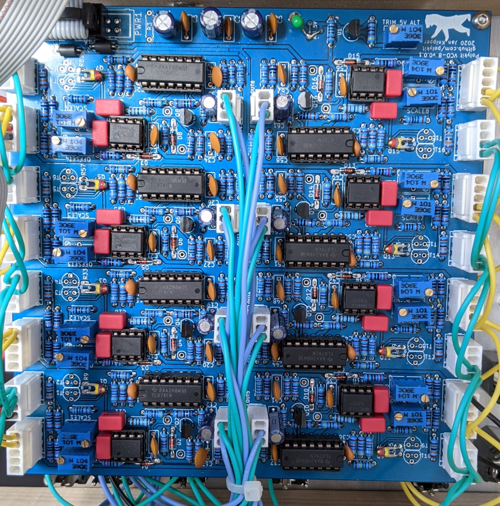

# Polykit Octo VCO

This repository contains schematics and PCB layout for an octo 1V/oct VCO. It is based on [this design](https://github.com/polykit/vco-1).

[Here you can listen to some short example how it sounds](https://soundcloud.com/user-350238569/polykit-octo-vco)

Documentation will follow.
